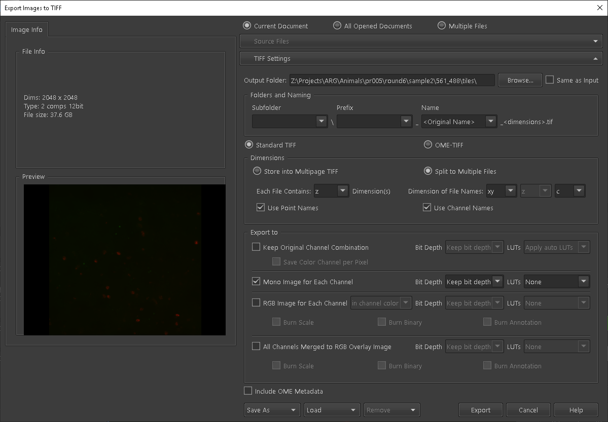
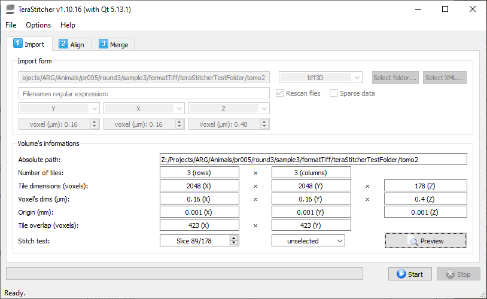
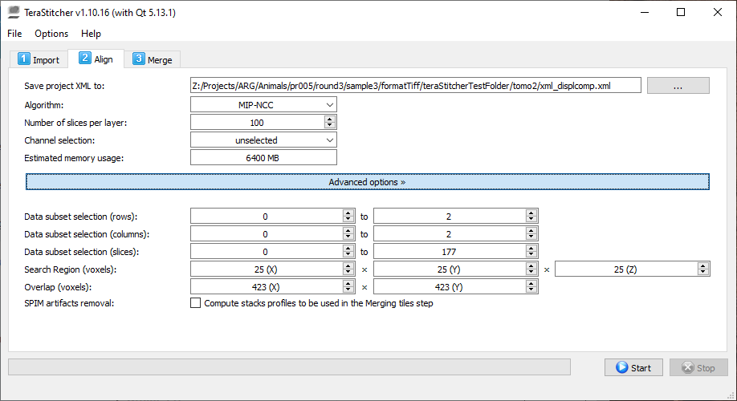
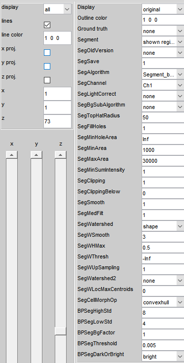

## Preprocessing Instructions
Output of the microscope is a single ND2. Before it can be imported into Starfish, this image needs to be converted to TIFF, stitched together, aligned, and registered. Cell segmentation should also be completed.

ND2 file locations for each channel/sample/round    
`Z:\Projects\ARG\Animals\pr005\File Location- CH- 9-27-19`

Folder structure for each channel/sample/round  


### Tools
* NIS Element
* [TeraStitcher](https://github.com/abria/TeraStitcher)
* [Baxter Algorithm](https://github.com/klasma/BaxterAlgorithms)
* Neurotator

### Steps
#### 1) Convert ND2 file to 9 TIFF tiles (NIS Element)
* Upload ND2 from `Z` drive
* Save/export to TIFF
* Double check parameters

* Export to `X` drive -> `01_Tiles`

#### 2) Format file directory (`ts_file_formatter.py`)
Create the correct file directory structure for TeraStitcher. There will be 9 TIFF files for every channel, this needs to be done for **every** channel.

```
python Z:\Personnel\Abed\Projects\Starfish\TeraStitcher\ts_file_formatter.py -f  <file_name> -a <input directory>
```

#### 3a) Merge TIFF tiles (TeraStitcher)

***Use Abed's build here `Z:\Personnel\Abed\Software\buildtera2\bin\Release\terastitcher-gui.exe`***

The 9 TIFF tiles each have 20% overlap with one another. This overlap needs to be removed and the whole image stitched together.

* Import files to TeraStitcher

   * Preview the import to make sure that the image looks reasonable and that the tiles are in the correct position
* Align 
* Merge
   * Use "Sinusoidal blending" (it's actually max blending)
   * Save to disk with the top resolution -> `02_Stitched`

#### 3b) Downsample
Images need to be downscaled 4x

Place all the stacks to be downsampled into the script to be done in parallel  
`Z:\Personnel\Abed\Projects\Starfish\rescaleTif\rescaleScript.m`

Save to -> `\Stiched\4xDS\`

#### 4) Align and register (Neurotator)

TODO
* Save to disk -> `03_Aligned`

#### 5) Cell segmentation (Baxter Algorithm)
This step is only done on the 561 channel.


